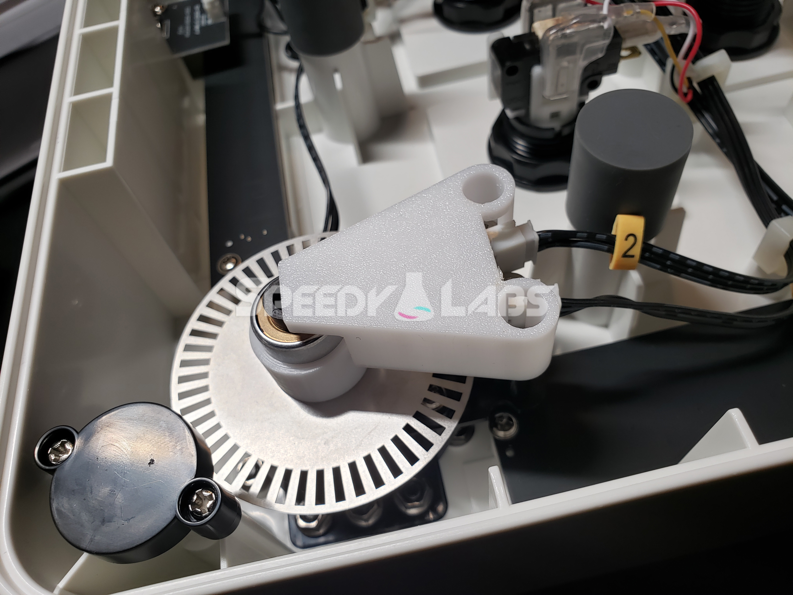

# faucetwo-torque-limiter
This work is licensed under a Creative Commons Attribution-NonCommercial-ShareAlike 4.0 International License.

Consumable proprietary rubber dampeners begone!  Uses a tok tleu1-618-5w torque limiter as tensioning just like a valkyrie knob assembly!

Note: This project has been fitted and tested but is still in beta.

This mod requires:
- 2x tok tleu1-618-5w
- 2x Part1 (3D printed)
- 2x Part2 (3D printed)

Video Guide:  
https://youtu.be/wjkP9TPzm_8?si=DwbVowPt-fkSv-2N

Barebones guide:
1. Remove magnetic bottom cover of your faucetwo
2. (Optional if your dampeners are already worn out.  Skip to step 4.) Remove dampener and plastic support pieces.  More detail is available in Gamo2's manual https://www.gamo2.com/en/download/Faucetwo_manual_en_20210106.pdf .
3. Reassemble the knob assembly without the dampener and plastic support pieces, but don't put on the spoked wheel yet.
4. Line up the spoked wheel on the end of the shaft, then sandwich it with Part1.  Screw in the 2 M3 screws.
5. Insert the torque limiter into Part1, lining up the tabs with the slots.  It should be a fairly tight press fit.  If your tabs aren't aligned, the torque limiter will be too tall.  You can pinch the torque limiter and rotate it while it's in Part1 to adjust.
6. Unscrew the two screws holding down the two light sensors in place, leaving the middle screw alone.
7. Put the screws into Part2 and line it up on top of the boards and screw it in.  Make sure to align the torque limiter slot with Part2.
8. Repeat with the second knob assembly.
9. Put the cover back on.  You're done!

## Pick up a kit or individual torque limiters here:  
https://www.speedylabs.us/product/faucetwo-torque-limiter-upgrade-kit/  
https://bluespringexpress.net/en-us/products/sound-voltex-torque-limiter-tok-tleu-618-5w

Note: The older tok tle1-618-5w is dimensionally shorter and won't work without some modifications.

P.S.
Honestly speaking, a fresh set of rubber dampeners on the faucetwo feels buttery smooth.  I was very surprised by this.  This mod still feels great in my opinion, but brings the smoothness of the knobs from a 10 down to a 9.  I think it's worth the tradeoff of never having to replace dampeners, but just thought I'd let y'all know my opinion after testing.
